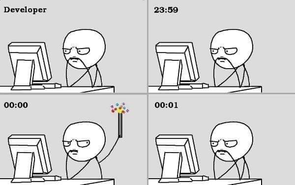

# Lab title
Version 0.0 of the laboratory 3, made in Java/Python. By Sebastian Racedo @JoaoRacedo.

## Minimum requirements
- [] Add class diagram
- [] Use linked lists for property data
- [] Add name, cost and rent to the property data
- [] Add player object with needed attributes
- [] Add multiplayer (at least 2 to 4 players)
- [] Add dice rolling
- [] Use files to save community chest and chance cards
- [] Implement community chest and chance cards
- [] Implement property selling
- [] Implement rent payments
- [] Other stuff

## Example image

