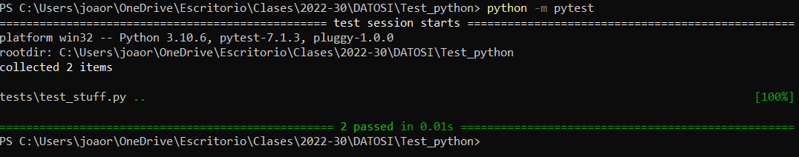
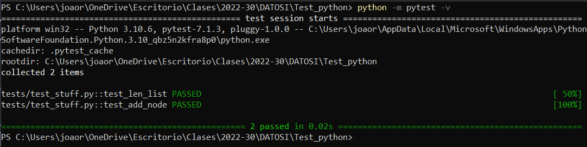

# Ejemplo de tests python

los tests en python nos ayudan a probar partes (metodos, funciones, etc) especificos de nuestro codigo y que estan hagan lo que deben hacer. En python existen varias librerias que nos ayudan a realizar esto, las dos mas usadas son:

* [pytest](https://docs.pytest.org/en/7.2.x/)
* [unittest](https://docs.python.org/3/library/unittest.html)

para este proyecto usamos `pytest`.

pytest se puede usar desde la termina (para apple o linux) o cmd/power shell (para windows), o usando la integracion que ya tiene con visual studio code. A continuacion veremos como se puede usar para ambos casos

## Pytest con Visual Studio Code
Una vez abierto VSC y terminados su scripts de pruebas y proyecto puede ir a la parte izquierda podran encontrar la ventana de `testing` o `testeo`. Aqui es donde se pueden encontrar las pruebas que VSC ha detectado en el proyecto. 
[Aqui](https://code.visualstudio.com/docs/python/testing) podran encontrar como usarlo.

## Pytest con terminal
Para poder usar pytest en la terminal debemos tenerlo instalado en el computador. Esto se puede hacer usando su manejador de paquetes, por ejemplo, pip.

```console
pip install pytest
```

Una vez instalado podemos proceder a hacer las pruebas. Para esto debemos desde la terminal llegar a la carpeta de nuestro proyecto. Una vez en esta podemos correr la siguiente linea de codigo.

```console
python -m pytest
```

para correr todas las pruebas (pytest buscara en todo el proyecto por los metodos que comiencen con test y los correra). A continuacion se puede ver un ejemplo:


De querer ver el resultado de cada prueba se puede correr

```console
python -m pytest -v 
```
A continuacion se puede ver un ejemplo:



